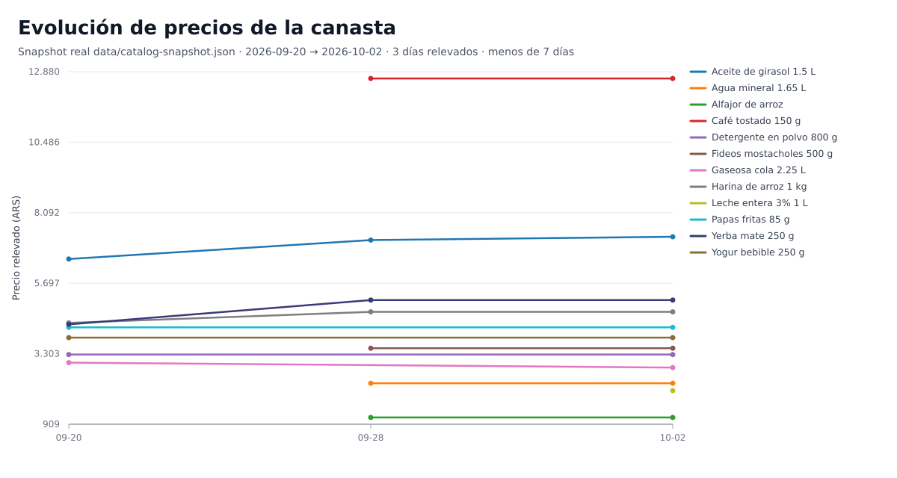

# ofertasSUPER

Comparador de precios y ofertas de supermercados de Argentina (Carrefour, Disco y
Jumbo) por GTIN-14: buscás un producto, ves el precio y la oferta en cada súper,
y armás un carrito que puede mezclar súpers.

- **Sitio en vivo:** https://ofertasuper.com
- **Runbook operativo** (actualización diaria, cron, Postgres, backups): [docs/RUNBOOK.md](docs/RUNBOOK.md)
- **Arquitectura** (flujo de datos y módulos clave): [ARCHITECTURE.md](ARCHITECTURE.md)

## Cómo fluyen los datos

Los scrapers VTEX leen el catálogo de cada súper y lo escriben en tablas de
staging de un Postgres local; un reconcile transaccional con advisory lock
fusiona cada observación en el catálogo vivo (identidad GTIN-14 con checksum),
un gate de frescura decide qué precio es "actual", y el pipeline exporta
`data/catalog-snapshot.json`: un snapshot JSON versionado que se commitea en el
repo. Vercel sirve ese snapshot a la app Next.js y a las APIs públicas, sin base
de datos en el camino de lectura; si falta o está corrupto, el sitio muestra "no
disponible", nunca datos demo. Detalle en [ARCHITECTURE.md](ARCHITECTURE.md).

## Producto de datos: series diarias e índice de canasta

Un segundo pipeline, independiente del sitio, exporta la serie diaria densa de
precios a Parquet y la modela con DuckDB + dbt (`analytics/`):

<!-- price-chart:start -->


Fuente: snapshot real `data/catalog-snapshot.json` · Rango 2026-09-20 → 2026-10-02 · 3 días relevados — menos de 7 días relevados: todavía no alcanza para leer una tendencia.
<!-- price-chart:end -->

- `scripts/export-price-series.ts` escribe una fila por (fecha, GTIN-14, súper)
  desde `price_history` y el estado de cada oferta; un valor con más de 24 h sin
  observarse queda nulo con un motivo explícito.
- El job diario sube un Parquet por día al release `analytics-data`
  (`scripts/analytics-data.sh`) y publica un índice Laspeyres de canasta fija
  comparado con el IPC Nivel General del INDEC.
- La página `/inflacion` renderiza `data/analytics/basket-index.json`
  precalculado: no hay base de datos en el camino de lectura. Mientras la serie
  no tenga al menos dos meses de canasta y un mes de IPC del INDEC superpuesto,
  el JSON publica un estado "datos insuficientes" sin valores y la página lo
  explica; nunca se muestran números de muestra en producción.
- Comandos, modelos, procedencia del IPC y limitaciones: [analytics/README.md](analytics/README.md).

## Desarrollo local

Requisitos: Node 22+, Docker (para el Postgres local).

```bash
npm ci
npx prisma generate
cp .env.example .env.local   # valores locales; las credenciales del bootstrap viven en ~/.config/ofertasuper/postgres.env (nunca se commitean)
docker compose up -d postgres
npm run dev
```

Comandos útiles:

```bash
npm run refresh:catalog   # leer fuentes, actualizar el catálogo y regenerar el snapshot
npm test                  # suite completa
npm run lint              # ESLint
npm run typecheck         # tsc --noEmit
```

La actualización diaria corre sola en la nube con GitHub Actions
(`.github/workflows/daily-refresh.yml`): restaura el estado desde un dump de
Postgres adjunto al release `db-state`, corre el mismo `npm run refresh:catalog`
con sus frenos y commitea el snapshot a `master`. No depende de la PC y no
necesita cuentas ni secretos extra (presupuesto USD 0). El cron local
(`scripts/cron-refresh.sh`) queda como fallback manual, y solo puede haber UN
escritor activo a la vez. El comando exacto, los frenos y la restauración del
Postgres están en [docs/RUNBOOK.md](docs/RUNBOOK.md).

## Limitaciones honestas

- Las promos simples son de Carrefour; Disco y Jumbo no exponen teasers por producto.
- Las promos bancarias y de fidelidad están fuera de v1.
- La frescura depende del refresh diario: el sitio siempre muestra el último
  snapshot commiteado, con su fecha de observación.
- El índice de canasta de `/inflacion` se recalcula con el refresh diario; su
  JSON declara la fuente, la cobertura y el estado, y hasta que exista la
  ventana comparable (2 meses de canasta + 1 mes de IPC superpuesto) la página
  muestra un estado vacío honesto, sin valores de muestra.
- Admin: acceso con falla cerrada salvo que la sesión de Clerk tenga el claim exacto de rol admin.

## Documentación histórica

Los planes largos, los specs de governance y los reportes operativos previos
viven en el tag de git `archive/full-governance` (`664674d`). Este repo mantiene
solo los documentos cortos y el runbook vigente.
